# Laura Luque Bravo
## RA2_IT1_AE1

### Ejercicios:

**1. Script que muestre el mensaje Hola Mundo entrecomillado.**

Con el siguiente script, se realizará el ejercicio 1:

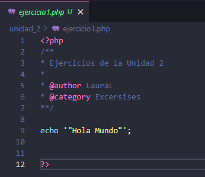

El resultado sería:


**2. Ficha personal con los datos cargados en variables. El resultado debe mostrar una foto personal.**

Con el siguiente script, se realizará el ejercicio 2:

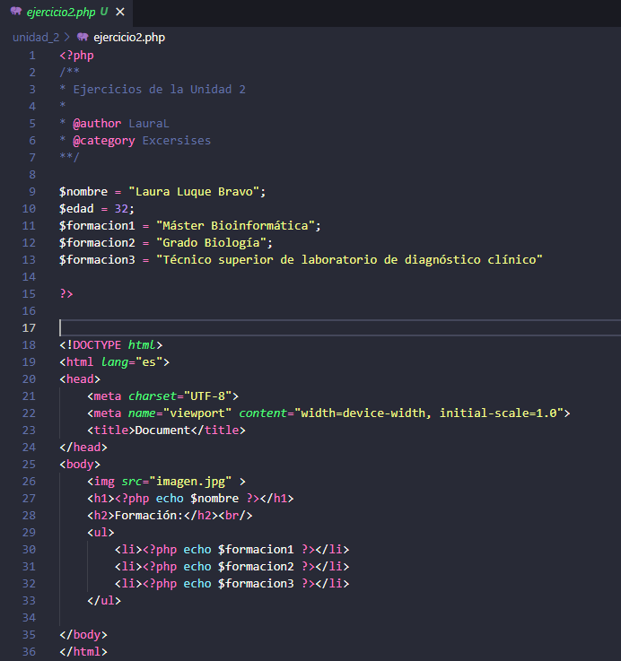

El resultado es:


**3. Script que, a partir del radio almacenado en una variable y la definición de la constante PI, calcule el área del círculo y la longitud de la circunferencia. El debe mostrar valor de radio, longitud de la circunferencia, área del círculo y dibujará un círculo utilizando gráficos vectoriales.**

Con el siguiente script, se realizará el ejercicio 3:

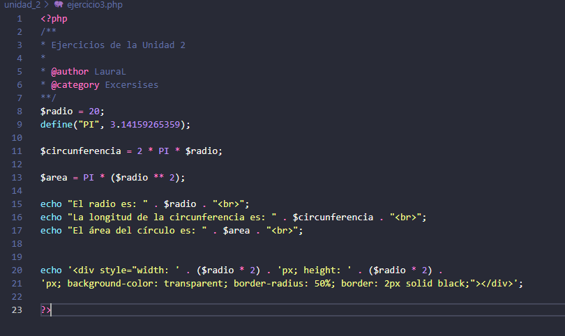
   
El resultado sería:

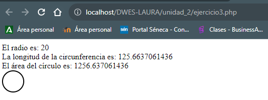


**4. ¿Cuál es la salida del siguiente script?**

```php
   <?php
    $ciclo="DAW";
    $modulo="DWES";
    print "<p>";
    printf("%s es un módulo de %d curso de %s", $modulo, 2, $ciclo);
    print "</p>";
```
**Prueba el script y modifícalo para las palabras DAW y DWES apararezcan en negrita. Investiga uso de print y printf para salida de texto.**

Con el siguiente script se relizará el ejercicio 4:

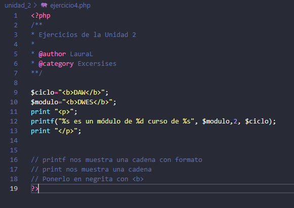

La salida del script ya modificado las variables es la siguiente:

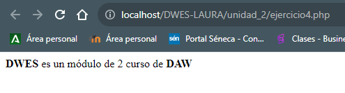

**5. Script que escriba el resultado de la suma de dos números almacenados en dos variables.**

Con el siguiente script se realizará el ejercicio 5:

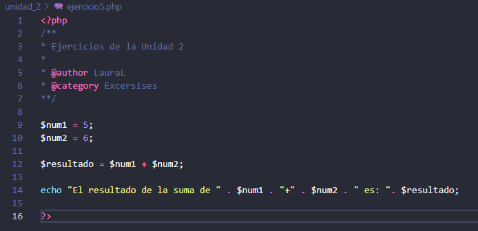

La salida sería:

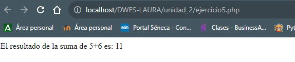


**6. Script que cargue las siguientes variables:**
    
```php
    $x=10;
    $y=7;
```

**y muestre:**

```php
    10 + 7 = 17
    10 - 7 = 3
    10 * 7 = 70
    10 / 7 = 1.4285714285714
    10 % 7 = 3
```

Con el siguiente script se realizará el ejercicio 6.

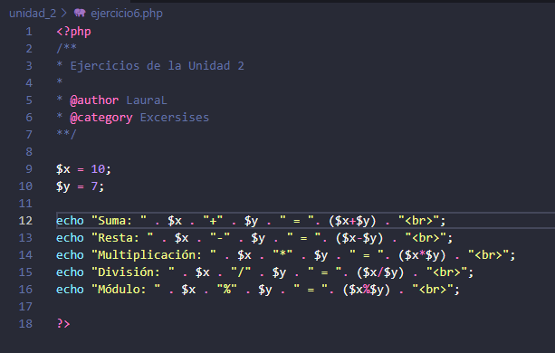

La salida es la siguiente:

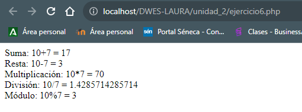

**7. Escribir un script que declare una variable y muestre la siguiente información en pantalla:**

```php
    Valor actual 8.
    Suma 2. Valor ahora 10.
    Resta 4. Valor ahora 6.
    Multipica por 5. Valor ahora 30.
    Divide por 3. Valor ahora 10.
    Incrementa el valor en 1. Valor ahora 11.
    Decrementa el valor en 1. Valor ahora 11.
```
Con el siguiente script se realizará el ejercicio 7:

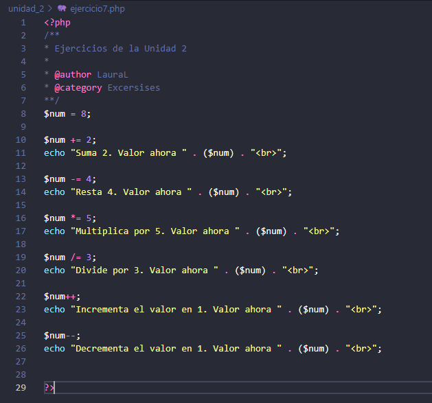

La salida es la siguiente:

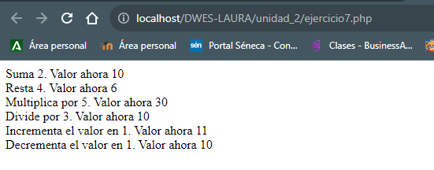

**8. A veces es necesario conocer exactamente el contenido de una variable. Piensa como puedes hacer esto y escribe un script con la siguiente salida:**

```php
    string(5) “Harry”
    Harry
    int(28)
    NULL
```
Con el siguiente script se realizará el ejercicio 8, donde se usará **`var_dump()`** se utiliza para obtener el tipo y el valor de la variable:

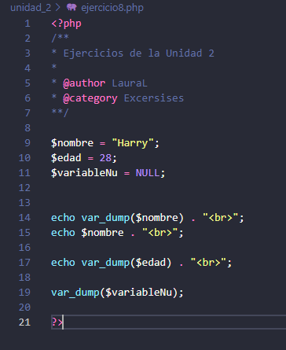

La salida sería la siguiente:

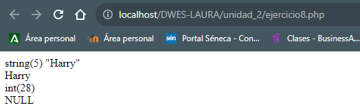

**9. Escribir un script que utilizando variables permita obtener el siguiente resultado:**

```php
    Valor es string.
    Valor es double.
    Valor es boolean.
    Valor es integer.
    Valor is NULL.
```
Con el siguiente script se realizará el ejercicio 9, donde se usará **`gettype()`** se obtiene solamente el tipo de la variable:

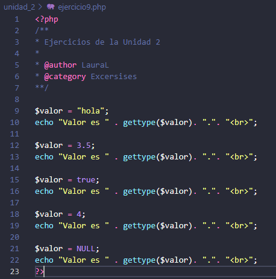

La salida sería la siguiente:

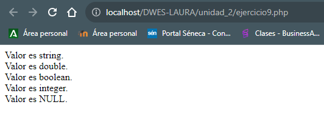

**10.Pon ejemplo de uso de la sintaxis heredoc en el manejo de cadenas.**

Con el siguiente script se realizará el ejercicio 10, donde se usa la **sintaxis heredoc** para textos largos:

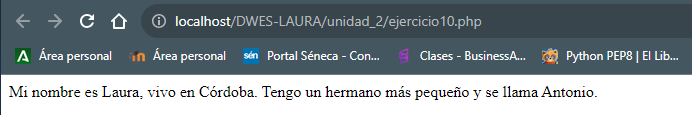

La salida sería la siguiente:

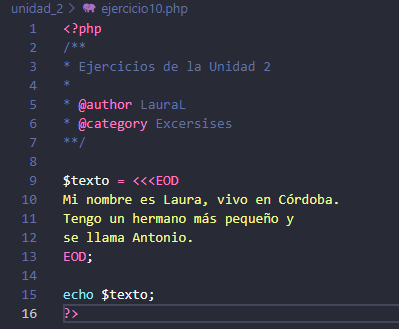
